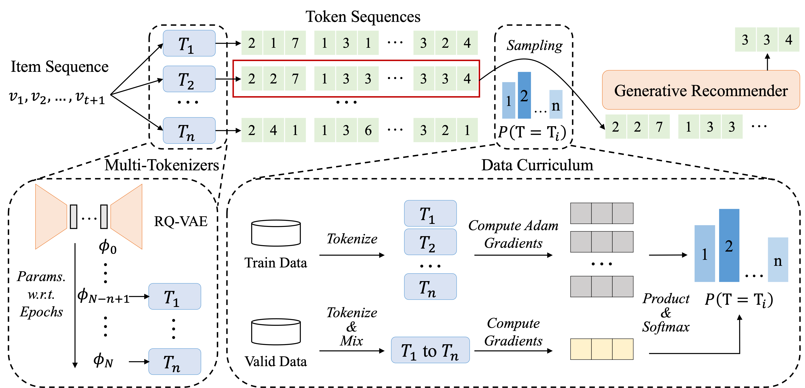

# MTGRec

This is the official PyTorch implementation for the paper:

> Multi-Identifier Item Tokenization for Generative Recommender Pre-training

## Overview

In this paper, we propose **MTGRec**, which leverages <u>M</u>ulti-identifier item <u>T</u>okenization to augment token sequence data for <u>G</u>enerative <u>Rec</u>ommender pre-training. Specifically, our approach makes two key contributions: *multi-identifier item tokenization* and *curriculum recommender pre-training*. For multi-identifier item tokenization, we adopt the Residual-Quantized Variational AutoEncoder (RQ-VAE) as the backbone of item tokenizers and consider model checkpoints from adjacent epochs as semantically relevant tokenizers. This enables us to associate each item with multiple identifiers and tokenize a single item interaction sequence into several token sequences as different data groups. For curriculum recommender pre-training, we design a data curriculum scheme through data influence estimation.  During recommender pre-training, we dynamically adjust the sampling probability of each data group according to the influence of the data from each item tokenizer, where the influence estimation is achieved via first-order gradient approximation. Finally, we fine-tune the pre-trained model using a single item identifier to ensure accurate item identification during recommendation. 



## Requirements

```
torch==2.4.1+cu124
transformers==4.45.2
accelerate==1.0.1
```

## Datasets

You can find all the datasets we used in [Google Drive](https://drive.google.com/file/d/1MAlKxygadJiVMiYHZRM14i7pnPd8J44w/view?usp=drive_link). Please download the file and unzip it to the current folder. Each dataset contains the following files:

```
dataset_name/
├── metadata.sentence.json
├── all_item_seqs.json
├── id_mapping.json
└── rqvae/
    ├── sentence-t5-base_256,256,256,256_9950.sem_ids
    ├── ...
    └── sentence-t5-base_256,256,256,256_10000.sem_ids
```

## Quick Start

Train RQ-VAE and generate item semantic IDs:

```shell
cd tokenizer
bash run.sh
```

Pre-train recommender:

```shell
bash pretrain.sh
```

Finetune recommender:

```shell
bash finetune.sh
```